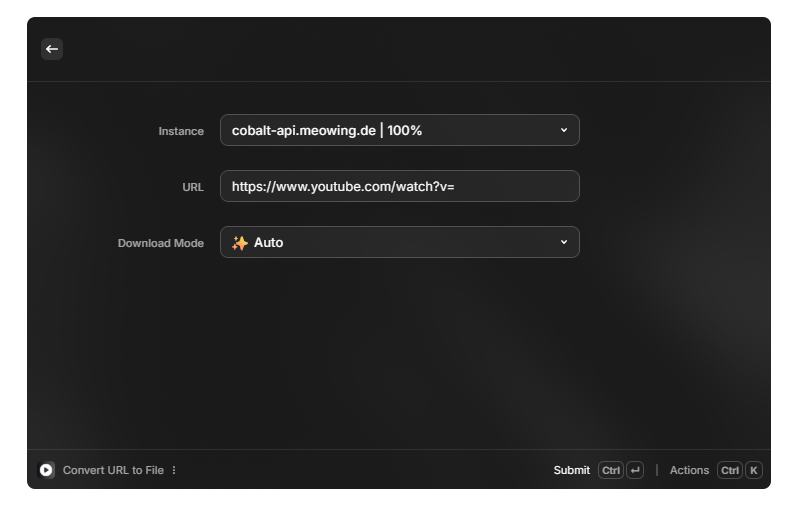

<picture>
    
</picture>

<h1 align="center">
  Cobalt for Raycast
</h1>

  Raycast extension to use the Cobalt.tools API

  <a href="https://github.com/imputnet/cobalt/blob/main/docs/run-an-instance.md">Run an instance</a>
  &nbsp;&nbsp;•&nbsp;&nbsp;
  <a href="https://cobalt.tools">Visit Cobalt</a>

# Introduction

Cobalt for Raycast is an extension that allows you to use [cobalt.tools](https://cobalt.tools) through Raycast.

## Commands

- **List Instances**: A view that shows a paginated list of all the instances you can use.
- **Convert URL to File**: Download media from multiple supported services (depending on the instance) using a URL.
  - Bilibili
  - Bluesky
  - Dailymotion
  - Facebook
  - Instagram
  - Loom
  - Ok
  - Pinterest
  - Newgrounds
  - Reddit
  - Rutube
  - Snapchat
  - Soundcloud
  - Streamable
  - Tiktok
  - Tumblr
  - Twitch Clips
  - Twitter
  - Vimeo
  - Vk
  - Xiaohongshu
  - Youtube

## Setup
To protect your privacy, you can add a custom instance directly in the extension preferences. **(Highly recommended)**

1. Go to the extension preferences.
2. Check **Enable Custom Instance** (**Highly recommended** if you own a custom instance).
#### Stop here if you don't
3. Add your custom instance URL.
4. Add your custom instance API key (if needed).
5. If needed, allow User-Agent `MonsPropre/cobalt-for-raycast` in your instance `keys.json`

## Disclaimer
- This extension is not affiliated with Cobalt Tools.
- Instance list is fetched from [instances.cobalt.best](https://instances.cobalt.best) that mean we do not own the instances and we are not responsible for them.
- To reduce the privacy risk, we only show instances with a minimum score of 50 in the **`Convert URL to File`** command (you can change this in the extension preferences).